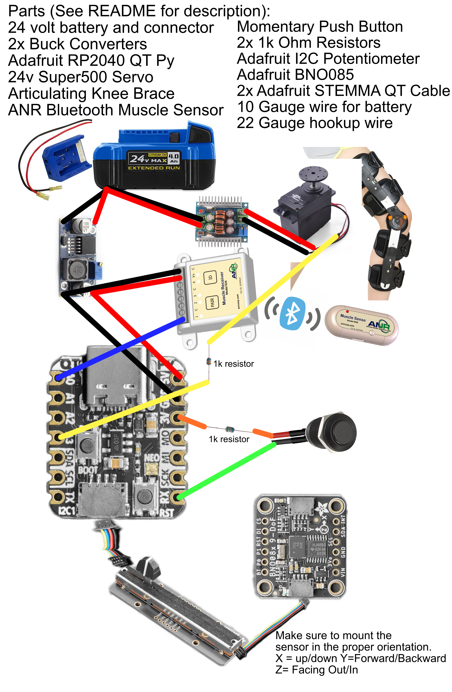

# Robot Leg Brace v2
## Introduction/Warning

Hi. I’ve been handicapped for about 9 years now, I’ve tried to seek out treatments to be able to walk again. However, because of the type of injury and the specific motion I’ve regained, there aren’t many options out there, especially for someone on a fixed income. I took it upon myself to build my own solution. I am not an engineer nor am I a programmer. **I do not recommend anyone follow in my footsteps. THIS IS DANGEROUS.** You could blow yourself up or injure yourself doing what I did. That said, I can walk without my crutch or cane again, which is all I wanted to do. I figured I’d share my project in case anyone else, who is poor and disabled like I am, wants to try to build their own solution. 

## Injury and Ability

My injury is unique and so my solution may not apply to you. I have full motion of my left leg; I can also straighten my right leg out and (mostly) hold my weight with it. The issue I have is being able to bend it back in after pushing it out. I also have foot drop, but I can point my toes easily enough. Again, it’s the bringing my foot back that is the issue. This device will detect when I want to bend my leg and do it for me.

## The Device

The device uses a knee brace as a base. I’ve attached a large servo to the outer thigh portion of the brace and used an old cut-up AFO foot brace to add rigidity to the two sides. I had a friend use a 3D printer to create a pulley to attach to the servo. A chain threaded through a spring which is wrapped around the servo wheel and attaches to the shin portion of the brace via another spring (this is to absorb shock of occasional muscle spasms I can have when my leg moves or is tired). When the servo rotates, it pulls the shin up, bending the knee. 

To control the servo, a microcontroller reads data from an accelerometer to determine where my leg is positioned during my walking gait. When my thigh reaches a certain angle, it will tell the servo to move, bending my leg. As I move forward, the angle will change and the servo will reverse direction, allowing me to straighten my leg again.

## Operation

There are only two (three if you want to control the feedback light) controls to operate the device. A potentiometer slider will set the angle threshold that tells the servo when in the walking gait to begin bending the leg and when to straighten it again. A simple momentary push button is used to override the sensors and manually bend the leg brace. This is useful for steps or uneven ground. You can operate the device in full manual mode by moving the slider all the way to one side (which side depends on how you’ve mounted it). An on-board LED light provides visual feedback of what state the brace is in. Green means the leg should be straight, red means the knee should be bent. There is an on-board button that can cycle through brightness levels with each push; levels are off, dim, medium, and bright.

## Code and Libraries

The code is written in CircuitPython 7.3 and uses the following libraries in the lib folder:

- adafruit_bno08x
- adafruit_bus_device
- adafruit_motor
- adafruit_seesaw
- adafruit_pixelbuf.mpy
- neopixel.mpy

Instructions for installing CircuitPython on the microcontroller can be found here: https://learn.adafruit.com/welcome-to-circuitpython/installing-circuitpython 

After installing, you should be able to copy 'code.py' and the entire 'lib' folder from this repository into the root directory of the microcontroller and you'll be done. Again, I am not a programmer, but I commented what most of it does to the best of my ability. 

## Design/Wiring Diagram

## Materials List for building Robot Leg Brace Version 2

- Brace https://www.amazon.com/gp/product/B07BT59Q6X
- Battery https://www.amazon.com/24-VOLT-4-0-AMP-LITHIUM-KB-424-03/dp/B01KAL4IO2
- Battery Quick Connect Terminal Adapter https://www.amazon.com/gp/product/B09BKGX81V
- Small Buck Converter https://www.amazon.com/gp/product/B07MKQXNWG/
- Large Buck Converter https://www.amazon.com/dp/B08GCX2RJ1
- Servo https://www.ebay.com/itm/123414770402
- 10 Gauge Wire https://www.amazon.com/Copper-American-Gauge-Wire/dp/B0796JJHTQ/
- 22 Gauge Wire https://www.amazon.com/Gauge-Wire-Solid-Hookup-Wires/dp/B088KQFHV7/
- Adafruit QT Py RP2040 https://www.adafruit.com/product/4900
- Adafruit BNO085 9-DOF Orientation Sensor https://www.adafruit.com/product/4754
- STEMMA QT Cable https://www.adafruit.com/product/4399
- 1k Ohm Resistors https://www.amazon.com/MCIGICM-Values-Resistor-Assortment-Resistors/dp/B06WRQS97C/

## Notes

The original design used a Raspberry Pi Zero, input/output controls, a screen, and muscle sensors. It was written in Python 3.7 using multiple libraries from adafruit, waveshare, and users on github. I will upload that version at some point as it was useful for gathering data in my walking gait and experimenting with different techniques for detecting when to bend the leg brace. For now, this is a simplified version targeted toward walking on even ground and can be built with minimal soldering and programming experience.

Once you have the device working, the next challenge will be to fit it on your leg without it moving around. A tight, secure fit is needed to ensure the brace moves your leg instead of moving *on* your leg. I attached the lower portion of the brace directly to my foot drop AFO but still ahve trouble with the thigh piece sliding around. You will have to experiment on your own to get it right. Good luck.

